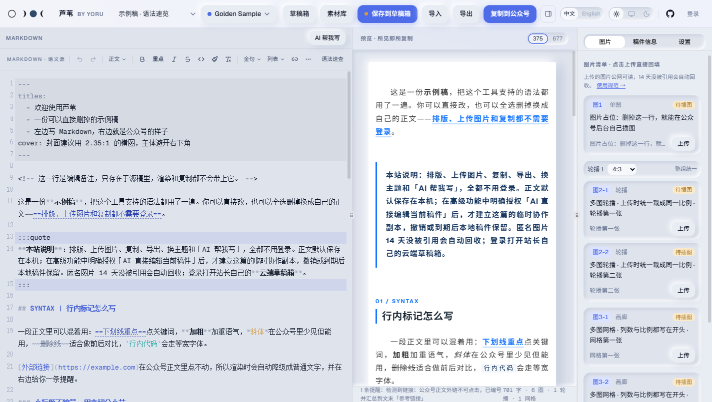
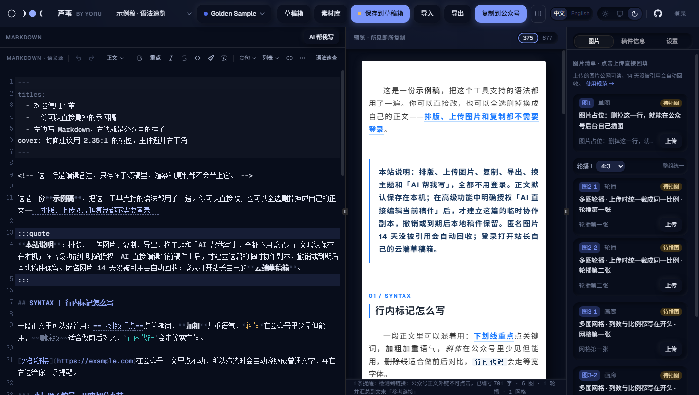
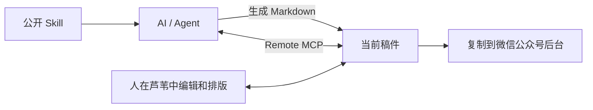
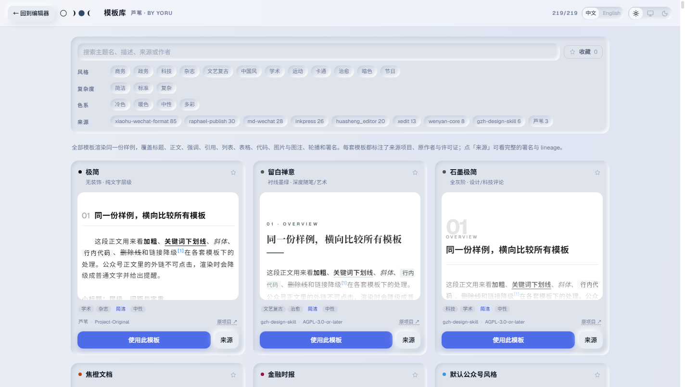
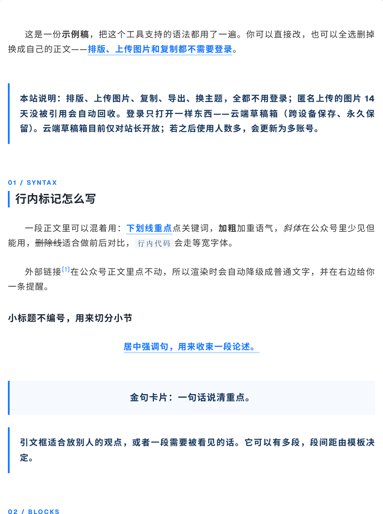

[中文](README.md) | [English](README_EN.md)

# 芦苇

> 人是一根会思考的芦苇。

**面向微信公众号的 Markdown 创作与排版工作台，让人和 AI 围绕同一份稿件协作。**

你可以把芦苇当作一个完整的公众号排版编辑器，也可以让自己常用的 AI 起稿、改稿，甚至通过 MCP 直接参与当前文档。最后仍由你在网页里完成校对、结构、图片和排版，再复制到微信公众号后台。

无论 AI 参与到哪一步，稿件始终是一份普通的 Markdown：可读、可编辑、可导出，也不绑定任何模型或写作平台。

**[在线使用芦苇 →](https://wechat.yoru-and-akari.dev)**

[主题库](https://wechat.yoru-and-akari.dev/themes) · [写作 Skill](https://wechat.yoru-and-akari.dev/skill.md) · [开源致谢](https://wechat.yoru-and-akari.dev/references)

by Yoru。一个自己持续使用、慢慢完善的个人项目。界面支持「中文 / English」切换（默认中文，选择记在本机），主要为电脑浏览器设计；觉得好用，欢迎在 [GitHub](https://github.com/yoruuuchan/wechat-md-studio) 留个 Star。

| akari（亮） | yoru（暗） |
|:--:|:--:|
|  |  |

## 为什么是芦苇

- **内容始终掌握在自己手里。** Markdown 是唯一的内容源，AI、网页编辑器、预览、复制和导出都围绕同一份稿件工作。
- **AI 协作不绑定模型。** 公开 Skill 可以交给 ChatGPT、Claude、Codex、OpenCode 或其他能读文本 / 链接的 AI；网页本身无需配置模型 API。
- **人保留最后一公里。** AI 适合起稿、整理、改写，人可以在真实页面里继续校对、调结构、处理图片、换主题，再决定最终发布的样子。
- **排版不是黑盒。** 219 套主题共享同一套语义 AST 和渲染链路，可以直接比较效果；主题作者、License 与移植来源会保留下来。
- **结果就是给微信用的。** 预览、整篇复制、局部复制和正文 HTML 导出共用渲染结果，输出针对微信公众号的全内联 HTML。

## 三种工作方式

### 1. 自己写，自己排

左栏编辑 Markdown，中栏实时预览，右栏处理图片、署名和设置。可以切换主题、调整结构、上传和裁切图片，复制整篇富文本，也可以在预览中框选一段单独复制。

常规稿件默认保存在浏览器本机。编辑、排版、上传、复制和导出都无需登录。图片通过图床进入正文，粘贴到微信公众号后台时由微信自行转存；发布前再核对后台预览。

### 2. 让 AI 按芦苇的规则起稿

打开编辑器左栏的「AI 帮我写」，把主题、读者、资料和篇幅交给自己常用的 AI。公开 [写作 Skill](https://wechat.yoru-and-akari.dev/skill.md) 说明芦苇支持的 Markdown 方言、文章结构、图片引用与写作注意事项。

AI 能读取链接，就把 Skill 地址发给它；不能读取链接，就复制完整 Skill。生成后把 Markdown 粘回芦苇继续编辑。界面已经准备好**复制提示词、复制 Skill 地址、复制完整 Skill**三个动作，无需登录、选择 AI 品牌或配置模型 API。

网页、公开地址与 MCP 读取都来自仓库里的 [同一份 Skill](skills/wechat-typesetter/SKILL.md)。

### 3. 让自己的 AI / Agent 直接编辑当前稿件

在右栏「设置 → 高级功能 → AI 直接编辑当前稿件」创建 **Remote MCP** 连接，未登录也能使用。页面会给出 Streamable HTTP 地址与 Bearer 请求头；配置到自己的 MCP 客户端后，AI 就能读取写作 Skill、读取这一篇稿件，并直接修改 Markdown。

授权限定到创建连接的游客和稿件，每篇单独授权。打开的浏览器会自动收到 AI 的修改，本机编辑也会同步回临时协作副本。更新带上读取时的内容 hash，版本过期会拒绝写入；两边都有未同步修改时，页面暂停同步，由你选择两边都留、保留本机版本或采用 AI 版本。撤销授权或连接到期后，本机稿件仍完整保留。



[接入说明](docs/remote-mcp.md)包含客户端配置、三个 MCP 工具、同步和授权期限。已用 OpenCode 原生客户端完成真实往返验证；其他支持标准 HTTP MCP 的客户端按各自方式接入。ChatGPT 若需要 OAuth，应另接适配层；当前核心 MCP 使用单稿件 Bearer 授权。

## 编辑器与排版

- **<!-- gen:theme-count -->219 套<!-- /gen:theme-count -->主题**：按风格、复杂度、色系与来源筛选，收藏常用模板，用同一份样稿比较效果；保留作者、License 与移植来源。
- **公众号 Markdown 方言**：章节自动编号、重点标记、金句卡、引文框、居中句、署名、表格、公式和 Mermaid 图表。
- **图片**：上传、压缩、自动 / 手动真实裁切、素材管理；同比例轮播与 2～4 列网格。
- **编辑与预览**：CodeMirror、Markdown 工具栏、语义格式刷、语法补全、同步滚动、375 / 677 预览；界面支持浅色 / 深色 / 跟随系统。
- **保存**：本机防丢，登录后使用站长的云端草稿箱；本机与云端同步同样有冲突处理。
- **导入导出**：Markdown、DOCX 导入；Markdown、正文 HTML、完整预览页与整包稿件备份导出。
- **Agent REST API**：保留独立的 REST API 和零依赖 Python 客户端，支持推稿 → 网页精修 → 读回结果，使用 hash 防止静默覆盖。它访问站长的云端稿件，需要单独配置 Agent 令牌，打开编辑链接需要浏览器登录；接入见 [Agent API](docs/agent-api.md)。

模板库中的卡片都渲染同一份样稿，方便比较；作者、色系与许可证直接列在卡片上。



默认 `golden` 主题的正文特写：首行缩进、章节编号、重点、链接脚注、金句卡和引文框。



## Markdown 方言速览

支持常规 Markdown 标题、列表、行内标记、围栏代码块与 GFM 表格。公众号扩展如下：

| 语法 | 效果 |
|---|---|
| `==重点==` | 关键词标记 |
| `## KICKER \| 标题` | 自动编号章节，可带短标签 |
| `> 金句` | 金句卡片 |
| `:::quote` / `:::center` … `:::` | 引文框 / 居中强调句 |
| `` | 图片与自动图号；空 `src` 留上传占位 |
| `` | 引用已上传的本站图片；公开 HTTPS 图片地址也可使用 |
| `:::carousel 4:3 标题` … `:::` | 同比例轮播，默认 `4:3` |
| `:::gallery 3 1:1 标题` … `:::` | 多图网格，默认两列正方形 |
| `$$ … $$` 独占一段 | 块级公式，转为 SVG；不支持行内公式 |
| 围栏代码语言为 `mermaid`，可附图注 | 图表转 PNG，沿图片链路上传 |
| `@signature` | 署名块 |
| `<!-- 备注 -->` | 源稿编辑备注，不进入正文；围栏代码中照常显示 |
| front matter `titles` / `cover` | 标题候选 / 封面建议，仅进入侧栏 |

完整 [示例稿](src/lib/sample.ts)和 [写作 Skill](skills/wechat-typesetter/SKILL.md)可以直接参照。参数、裁切、公式与微信兼容规则见 [渲染与图片](docs/rendering.md)。

## 本地运行

使用 Node.js 24（当前验收版本）。在含 `package.json` 的目录运行；本地伞仓库中先进入 `app/`。

```bash
npm ci
cp .env.example .env
npm run dev
```

PowerShell 用 `Copy-Item .env.example .env` 复制配置，默认打开 `http://localhost:3000`。开发配置中删掉 `NODE_ENV` 整行：将它写为 `development` 会影响 Vite 的 React 生产构建。图床、密钥与生产启动方式见 [配置说明](docs/configuration.md)。

| 命令 | 用途 |
|---|---|
| `npm run check` | TypeScript 检查 |
| `npm test` | Vitest 单元与服务端测试 |
| `npm run verify:themes` | 全主题渲染与微信规则校验 |
| `npm run sync:docs` / `npm run verify:sources` | 生成并核对中英文 README 的主题统计、来源与致谢 |
| `npm run build` | 构建 `dist/boot.js` 与 `dist/public/` |
| `npm start` | 生产服务；PowerShell 启动见配置文档 |

核心链路是 `Markdown → 语义 AST → Theme → 微信兼容的全内联 HTML`。React + Vite + CodeMirror 负责编辑，Hono 提供 tRPC / REST / MCP；IndexedDB / localStorage 保存本机稿件，SQLite 保存云端稿件和明确授权的临时协作副本，图片 Worker + R2 承载图片。预览、复制和正文 HTML 导出共用渲染结果。

## 保存、图片与使用边界

- **正文默认在本机。** 开启 Remote MCP 后才上传这一篇的临时协作副本，默认 24 小时有效。只有对应游客与持有该篇令牌的客户端能读写；撤销立即删除副本，到期立即拒绝访问并定期清理，本机稿件保留。登录另打开站长云端草稿箱。
- **上传图片公网可读。** 图片落在本站对象存储，通过 `/api/img/…` 公开提供；拿到链接的人都能看到。匿名图片有上传额度，默认按 14 天期限回收；本机稿件中的引用不保证图片永久保留。微信粘贴成功并转存后，公众号中的图片由微信保存。
- **内容由执笔与发布的人负责。** 本站做格式、额度与文件类型检查，不审阅稿件或图片内容。禁止用图床传播违法内容、涉及未成年人的性内容、侵权或侵犯隐私的内容、恶意程序与诈骗素材，也禁止当网盘批量灌图。发现违规内容可删除文件并拒绝继续接收。

完整规则见 [使用规范](https://wechat.yoru-and-akari.dev/terms)。权利投诉通过站内反馈表单提交（[wechat.yoru-and-akari.dev/feedback](https://wechat.yoru-and-akari.dev/feedback)，或编辑器右栏「设置 → 反馈」），写明具体地址、权利人或受托说明与联系方式；收件邮箱不公开在页面上，由服务端转发。服务按现状提供，可能变更、限流或下线；软件无担保。自行部署时，存储、域名与使用规则由部署者管理。

## 开源与资料

项目采用 **AGPL-3.0-or-later**，见 [LICENSE](https://github.com/yoruuuchan/wechat-md-studio/blob/master/LICENSE)。

<!-- BEGIN GENERATED: readme-theme-sources — npm run sync:docs -->
主题库共 **219 套**：3 套自研 + 8 个上游项目的 216 套主题，来源与许可维护在统一 metadata 中。

主题审计见 [THEME-SOURCES](THEME-SOURCES.md)；工程借鉴、取舍与完整致谢由 [credits.ts](src/lib/credits.ts) 驱动 [References](https://wechat.yoru-and-akari.dev/references) 与 [LICENSES/NOTICE](LICENSES/NOTICE.md)。
<!-- END GENERATED: readme-theme-sources -->

| 资料 | 内容 |
|---|---|
| [AGENTS.md](AGENTS.md) | 开发 Agent 入口、模块导航与工程约束 |
| [AI 写作与 Remote MCP](docs/remote-mcp.md) / [Skill](skills/wechat-typesetter/SKILL.md) | 写稿规则、授权当前稿件与客户端接入 |
| [稿件与编辑器](docs/documents.md) | 本机 / 云端保存、合并、冲突、草稿箱和导入导出 |
| [渲染与图片](docs/rendering.md) | Markdown、Theme、微信 HTML 与图片生命周期 |
| [Agent API](docs/agent-api.md) | REST / Python 推稿与读回 |
| [配置](docs/configuration.md) / [验证](docs/verification.md) / [HANDOFF](HANDOFF.md) | 运行、测试与部署 |
| [品牌与兼容标识](docs/branding.md) | 芦苇 / Reed 的命名与保留内部标识的原因 |

仓库名 `wechat-md-studio` 和现有域名保持不变。
