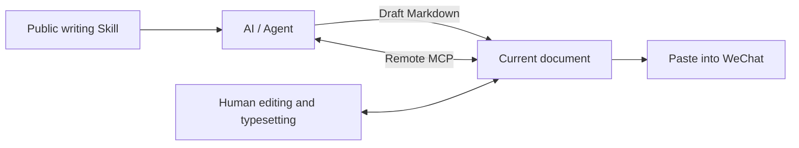

[中文](README.md) | [English](README_EN.md)

# Reed · 芦苇

> “Man is but a reed, the most feeble thing in nature; but he is a thinking reed.”
> — Blaise Pascal, [Pensées, §347](https://www.gutenberg.org/files/18269/18269-h/18269-h.htm#SECTION_VI)

**A Markdown writing and typesetting workspace for WeChat Official Accounts, built for humans and AI to work on the same draft.**

Use Reed as a complete WeChat article editor, ask the AI you already use to draft or revise an article, or connect your own agent through MCP and let it work directly on the current document. You still finish the article in the browser: review the text, shape the structure, handle images, choose the presentation, and copy the result into WeChat.

However much AI is involved, the source remains ordinary Markdown: readable, editable, exportable, and independent of any model or writing platform.

**[Open Reed →](https://wechat.yoru-and-akari.dev)**

[Theme library](https://wechat.yoru-and-akari.dev/themes) · [Writing Skill](https://wechat.yoru-and-akari.dev/skill.md) · [Acknowledgements](https://wechat.yoru-and-akari.dev/references)

Made by Yoru, as a personal project that is continuously used and improved. The interface switches between Chinese and English (Chinese by default, remembered per browser) and is designed mainly for desktop browsers. If Reed is useful to you, a [GitHub Star](https://github.com/yoruuuchan/wechat-md-studio) is welcome.

| Light · akari | Dark · yoru |
|:--:|:--:|
|  |  |

## Why Reed

- **Your document stays yours.** Markdown is the single content source. AI, browser editing, preview, copy and export all work around the same draft.
- **Bring your own AI.** The public Skill can be given to ChatGPT, Claude, Codex, OpenCode or any other AI that can read text or links. Reed itself does not require a model API for this workflow.
- **Humans keep the final mile.** AI can draft, organize and revise; you can continue in the real editor to review the wording, reshape sections, handle images, switch themes and decide what actually gets published.
- **Typesetting is inspectable.** All 219 themes consume the same semantic AST and rendering pipeline, so they can be compared against the same content. Author, license and provenance information stay attached to adapted themes.
- **The output is made for WeChat.** Preview, full-document copy, selection copy and article HTML export share the same renderer and produce fully inline HTML for WeChat Official Accounts.

## Three ways to work

### 1. Write and typeset it yourself

Markdown is on the left, the live article preview in the middle, and images and settings on the right. Choose a theme, revise the structure, upload and crop images, adjust credits, copy the entire article as rich text, or select a passage in the preview and copy only that part.

Routine drafts are stored locally in your browser by default. Editing, typesetting, image uploads, copying and exports work without login. Hosted images are transferred into WeChat when you paste the article; check WeChat's own preview before publishing.

### 2. Give your AI Reed's writing rules

Open **AI 帮我写** (“Help me write”) in the editor and send your topic, audience, source material and desired length to the AI you already use. The public [Writing Skill](https://wechat.yoru-and-akari.dev/skill.md) describes Reed's Markdown dialect, article structures, image references and writing precautions.

If your AI can open links, send it the Skill URL. Otherwise, copy the full Skill text. Paste the generated Markdown back into Reed and continue editing. The interface provides three ready-made actions: **copy prompt, copy Skill URL, and copy full Skill**. No login, AI brand selection or model API configuration is required.

The website, public endpoint and MCP tool all expose [the same repository Skill](skills/wechat-typesetter/SKILL.md). The Skill is currently in Chinese; its syntax examples are the shared reference.

### 3. Let your own AI / agent edit the current document

Open **设置 → 高级功能 → AI 直接编辑当前稿件** (“Settings → Advanced → Let AI edit this document”) and create a **Remote MCP** connection. Guests can use it too. Reed provides a Streamable HTTP endpoint and Bearer authorization header; configure them in a compatible MCP client and the agent can read the writing Skill, read this document and update its Markdown directly.

Authorization is scoped to one visitor and one document. AI edits appear automatically in the open browser, while browser edits sync back to the temporary collaboration copy. Every write carries the hash of the version it read. Stale writes are rejected; if both sides have unsynced changes, the browser pauses synchronization and lets you keep both versions, keep the local version or use the AI version. Revoking access or letting the connection expire leaves the complete local draft intact.



[Remote MCP documentation](docs/remote-mcp.md) covers client configuration, the three MCP tools, synchronization and authorization lifetime. A native OpenCode client has been tested end to end. Other clients use their own standard HTTP MCP setup. ChatGPT connectors may require a separate OAuth adapter; the core server uses document-scoped Bearer authorization.

## Editor and typesetting

- **<!-- gen:theme-count -->219 themes<!-- /gen:theme-count -->** with filters for style, complexity, color and source. Favorite templates and compare them using the same sample. Author, license and provenance are retained.
- **Article-oriented Markdown**: numbered sections, highlights, pull quotes, quotation boxes, centered text, credits, tables, block equations and Mermaid diagrams.
- **Images**: upload, compression, automatic or manual cropping, a media library, same-ratio carousels and two- to four-column galleries.
- **Editing and preview**: CodeMirror, a Markdown toolbar, semantic format painter, syntax completion, synchronized scrolling and 375 / 677 preview widths. Light, dark and system UI modes.
- **Storage**: local draft protection, plus the site owner's cloud draft library after login, with synchronization and conflict handling.
- **Import / export**: import Markdown and DOCX; export Markdown, article HTML, a complete preview page or a full document backup.
- **Agent REST API**: a separate API and dependency-free Python client for pushing a draft, opening it for human editing and reading it back. This interface accesses the site owner's cloud documents, requires an Agent token, and needs browser login for its editor links. See [Agent API](docs/agent-api.md).

Every theme card renders the same sample article, so comparisons show the theme rather than different content. Author, color and license information are shown directly on each card.


A closer look at the default `golden` theme, including first-line indentation, numbered headings, highlights, link footnotes, pull quotes and quotation boxes:


## Markdown at a glance

Standard headings, lists, inline formatting, fenced code blocks and GFM tables work alongside these extensions:

| Syntax | Result |
|---|---|
| `==highlight==` | Highlighted words |
| `## KICKER \| Heading` | Automatically numbered section with an optional label |
| `> A memorable line` | Pull-quote card |
| `:::quote` / `:::center` … `:::` | Quotation box / centered emphasis |
| `` | Image with an automatic figure number; an empty URL creates an upload placeholder |
| `` | Existing hosted image reference; public HTTPS image URLs also work |
| `:::carousel 4:3 Title` … `:::` | Same-ratio carousel, default `4:3` |
| `:::gallery 3 1:1 Title` … `:::` | Image grid, default two square columns |
| A standalone `$$ … $$` block | Equation rendered as SVG; inline equations are not supported |
| A fence with language `mermaid` and an optional caption | Diagram rendered to PNG and uploaded |
| `@signature` | Article credits block |
| `<!-- Note -->` | Source-only editorial note; remains literal inside code fences |
| Front matter `titles` / `cover` | Title candidates / cover suggestion, shown only in the side panel |

Use the [sample article](src/lib/sample.ts) and [Skill](skills/wechat-typesetter/SKILL.md) as examples. Image ratios, cropping and WeChat HTML constraints are documented in [Rendering and images](docs/rendering.md). Most technical documentation is currently in Chinese.

## Run locally

Use **Node.js 24**, the currently tested version. Run these commands from the directory containing `package.json` (`app/` in the local umbrella repository):

```bash
npm ci
cp .env.example .env
npm run dev
```

In PowerShell, use `Copy-Item .env.example .env`. Open `http://localhost:3000`. Remove `NODE_ENV` from the development `.env`: setting it to `development` also affects Vite's React production build. See [Configuration](docs/configuration.md) for image hosting, production secrets and startup commands.

| Command | Purpose |
|---|---|
| `npm run check` | TypeScript checks |
| `npm test` | Unit and server tests with Vitest |
| `npm run verify:themes` | Render every theme and check WeChat compatibility |
| `npm run sync:docs` / `npm run verify:sources` | Generate and verify theme statistics in both READMEs, provenance and acknowledgements |
| `npm run build` | Build `dist/boot.js` and `dist/public/` |
| `npm start` | Start production; see Configuration for PowerShell |

The rendering pipeline is `Markdown → semantic AST → Theme → fully inline WeChat-compatible HTML`. React, Vite and CodeMirror handle editing; Hono provides tRPC, REST and MCP. IndexedDB / localStorage hold local drafts, SQLite holds cloud documents and explicitly authorized temporary collaboration copies, and a Worker with R2 hosts images. Preview, copy and article HTML export share the same result.

## Data and publishing boundaries

- **Drafts are local by default.** Enabling Remote MCP uploads a temporary copy of that document, valid for 24 hours by default. Only its visitor and token-bearing clients can access it. Revocation deletes it immediately; expiry blocks access immediately and scheduled cleanup removes it. The local draft remains. The owner's cloud library is a separate login-only feature.
- **Uploaded images are public.** Anyone with an `/api/img/…` URL can view the file. Anonymous uploads have quotas and a default 14-day cleanup period; keeping a reference in a local draft does not guarantee indefinite hosting. Once WeChat has copied an image, the published article uses WeChat's stored version.
- **Authors and publishers are responsible for content.** The service checks file types and quotas, and does not review article or image content. Illegal, exploitative, infringing or privacy-violating content, malware, scams and bulk file-storage abuse are prohibited. Files can be deleted and further uploads refused.

Read the [Terms of use](https://wechat.yoru-and-akari.dev/terms). Rights complaints go through the in-site feedback form ([wechat.yoru-and-akari.dev/feedback](https://wechat.yoru-and-akari.dev/feedback), or the editor sidebar under Settings → Feedback) with the exact URL, evidence of your rights or authorization, and contact details; no receiving address is published on the page — the server forwards the message. The hosted service may change, be limited or go offline; the software is provided without warranty. Self-hosters manage their own storage, domains and terms.

## License and further reading

The application is licensed under **AGPL-3.0-or-later**; see [LICENSE](https://github.com/yoruuuchan/wechat-md-studio/blob/master/LICENSE).

<!-- BEGIN GENERATED: readme-theme-sources — npm run sync:docs -->
The library contains **219 themes**: 3 originals and 216 adapted from 8 upstream projects. Authors, licenses and provenance are recorded in shared metadata.

See [THEME-SOURCES](THEME-SOURCES.md) for the audit. Project acknowledgements and adaptation notes come from [credits.ts](src/lib/credits.ts) and appear in [References](https://wechat.yoru-and-akari.dev/references) and [LICENSES/NOTICE](LICENSES/NOTICE.md).
<!-- END GENERATED: readme-theme-sources -->

| Document | Covers |
|---|---|
| [AGENTS.md](AGENTS.md) | Contributor entry point and engineering rules |
| [AI writing / Remote MCP](docs/remote-mcp.md) / [Skill](skills/wechat-typesetter/SKILL.md) | Writing instructions and single-document collaboration |
| [Documents and editor](docs/documents.md) | Storage, synchronization, conflicts and backups |
| [Rendering and images](docs/rendering.md) | Markdown, themes, WeChat HTML and image lifecycle |
| [Agent API](docs/agent-api.md) | REST / Python push-and-read-back workflow |
| [Configuration](docs/configuration.md) / [Verification](docs/verification.md) / [HANDOFF](HANDOFF.md) | Development, checks and deployment |
| [Brand and compatibility](docs/branding.md) | Naming and retained internal identifiers |

Reed's Chinese name is **芦苇**. The repository name `wechat-md-studio` and existing domains stay unchanged.
