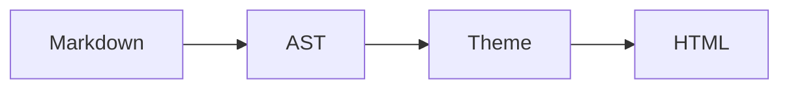

# 微信渲染与图片链路

[项目首页与语法表](../README.md) · [Agent 入口](../AGENTS.md) · [验证导航](verification.md)

本文说明实现和取舍；可执行规则来自 [types.ts](../src/lib/types.ts)、[parse.ts](../src/lib/parse.ts)、
[render.ts](../src/lib/render.ts)、[theme-kit.ts](../src/lib/theme-kit.ts)、相关测试与
[verify-themes.ts](../scripts/verify-themes.ts)。

## 渲染边界

`Markdown → 语义 AST → Theme → 微信兼容的全内联 HTML`。
parser 只产出语义节点和全稿源位置，不为某套主题做视觉判断；Theme 提供组件模板，
`renderDoc` 统一编号、收集外链、插入盒式模块空行，并返回 HTML、统计和块偏移。
预览、富文本复制和干净正文导出消费同一份 HTML，主题变化不改源稿。

`golden` 最初以「公众号排版示范稿_GoldenSample_修正版.html」为设计基线；该稿如另行提供，按提供版本核对。
仓库内可复现的样稿与规则以 [sample.ts](../src/lib/sample.ts) 和 `verify:themes` 输出为准。

公式、图片和 Mermaid 的异步工作在编辑器编排层完成，通过 `resolveImg` / `resolveMath` /
`resolveDiagram` 注入缓存结果，保持 `renderDoc` 同步、可在 Node 中运行。
导出的完整预览页另有按钮和外壳；微信兼容规则检查的是其中的正文根节点。

## 正文兼容规则

| 边界 | 当前规则与检查入口 |
|---|---|
| 结构 | 唯一顶层 `<section>`，允许嵌套；正文不带 `class` / `id` / `<script>` / `<style>` / `<div>` |
| 文字 | 正文文字包在 `<span leaf="">`；代码块保留缩进并使用 `white-space:pre-wrap` |
| 样式 | 全内联；禁 `position:fixed/absolute/sticky`、`float`、`display:grid`、`@media`、`@keyframes`；导入样式由 `sanitizeStyle` 清理 |
| 盒式模块 | renderer 插入独立空行 `<p style="margin:0;"><span leaf="">&nbsp;</span></p>`，合并连续空行 |
| 图片 | 空 `src` 生成普通 `图N 说明` 占位段落；单图、轮播、网格都解析 `img:<key>` |
| 表格 | 真 `<table>`，单元格保留边框、leaf 文字与逐列对齐 |
| 多图 | 比例由真实裁切保证；图片保留确定宽高属性及 `height:auto`，不用 `object-fit` 或固定图片高度伪造 |
| 公式 | SVG 另由 [math-sanitize.ts](../src/lib/math-sanitize.ts) 与 [测试](../src/lib/math-sanitize.test.ts) 检查，不把 MathJax 原始输出直接插进正文 |

完整断言以 `verify:themes` 和相邻测试为准，不在其他文档另建规则副本。
`html:false` 禁止 Markdown 原样 HTML；[comments.ts](../src/lib/comments.ts) 把编辑备注等长空格化，
保留行号与字符偏移，围栏代码中的注释仍显示。图片 occurrence 扫描与回填必须对称跳过围栏 / 注释，
否则重复图注会填错图片。对应 [comments.test.ts](../src/lib/comments.test.ts)、
[fences.test.ts](../src/lib/fences.test.ts)、[render.image-ops.test.ts](../src/lib/render.image-ops.test.ts)。

非空且非 `#fragment` 的链接当前都转成编号脚注，文末按 URL 去重；详细行为以
[footnotes.test.ts](../src/lib/footnotes.test.ts) 为准。front matter 的 `titles` / `cover` 只供侧栏，
支持简单键值与标题列表，完整示例在 [sample.ts](../src/lib/sample.ts)。

## 公式

`$$…$$` 独占一段生成块级公式，可单行或多行；当前 parser 不解析行内 `$…$`。
[math.ts](../src/lib/math.ts) 按需加载固定版本的 `mathjax-full` v3，使用 `liteAdaptor` 与
`fontCache:'none'`，让 SVG 自带 path，不依赖共享字体缓存或外部 CSS。
TeX 包白名单、MathJax Safe 与序列化 SVG 消毒共同限制可进入正文的内容。

加载时显示 TeX 占位，编译 / 消毒失败时显示「公式无法编译」与源码，并留下诊断；
不把 MathJax 的红色错误盒子当作公式复制。结果按 TeX 与 display 状态缓存。
2026-10-07 的微信实粘记录支持保留 `ex` 尺寸与 `currentColor`，只在 wrapper 明确颜色，
不手算 `ex → px`；对应 [math.test.ts](../src/lib/math.test.ts) 与 [浏览器脚本](../scripts/cdp-verify-math.mjs)。

## Mermaid

````md

````

停手约 1.2 秒后：[diagram-raster.ts](../src/lib/diagram-raster.ts) 按需加载 Mermaid，
`SVG → canvas → PNG → storage.upload → img:<key>`，正文最终渲染普通 ``，参与图号和素材统计。
当前匿名访客也走上传链路，受匿名额度约束；语法 / 上传失败会提示原因并在正文保留源码。
复制时若图表仍在处理，编辑器会提示等待。

选择 PNG 是为了保持纯字符串渲染链与统一图片管线。上游 SVG 常带 style、class、id、foreignObject；
完整 SVG 适配还依赖活 DOM 的 `getBBox` / `getComputedStyle`，相关方案比较保留在
[credits.ts](../src/lib/credits.ts) 的 doocs/md 条目。
代价是图中文字不可选、图片颜色不随主题变化、改源码需重新生成并上传。

源码始终留在 Markdown；PNG 是按源码键缓存的派生结果。
[diagram.ts](../src/lib/diagram.ts) 将映射保存在 `mopai.diagrams.v1`，最多 50 条；换设备会重新生成。
逻辑与真实链路分别见 [diagram.test.ts](../src/lib/diagram.test.ts)、
[diagram-raster.test.ts](../src/lib/diagram-raster.test.ts)、[cdp-verify-diagram.mjs](../scripts/cdp-verify-diagram.mjs)。

## 图片上传、定位与生命周期

```text
拖拽 / 粘贴 / 侧栏上传 → 浏览器真实裁切与压缩
→ tRPC storage.upload → 图片 Worker → R2
→ Markdown 回填 img:<key>
→ resolveImg 展开成 <当前 origin>/api/img/<key>
→ 站点 302 → Worker 公网图片 → 微信自行转存
```

裁切在 [image.ts](../src/lib/image.ts)，压缩在 [image-compress.ts](../src/lib/image-compress.ts)：
默认最长边 2048、目标 800 KiB、quality 从 0.9 按 0.1 降到 0.6；不放大小图，重编码增大时优先原文件。
这是编码目标，不替代服务端的 20 MiB 上限与 JPEG / PNG / GIF / WebP 字节头检查。
具体入口的裁切 / 压缩组合见 [EditorPage.tsx](../src/pages/EditorPage.tsx)。

复制的 HTML 必须包含绝对公网图片 URL，`/api/img/*` 要能匿名读取。
短 key 稳定不等于图片永久保留：匿名图可能在默认 14 天后因没有云端引用被回收，
详见 [HANDOFF](../HANDOFF.md#安全与匿名资源回收)。站长图不属于匿名 GC 范围。
已经被微信转存的文章图片不受本站删图影响。

## 轮播与网格

`:::carousel [比例] 标题` 默认 `4:3`；支持 `4:3`、`3:4`、`16:9`、`9:16`、`1:1`。
第一张上传时选择比例，同组后续图片沿用；自动居中或手动裁切都发生在上传前。
改比例不重新生成旧图，需重传 / 重裁；裁掉的部分不在图床保留，需要原图。

```md
:::gallery 3 4:3 现场花絮


:::
```

网格列数支持 `2` / `3` / `4`，默认两列正方形。裸整数识别为列数，带冒号识别为比例，
所以 `:::gallery 4:3 标题` 表示默认两列 + 4:3；不支持的值保留在标题中。
轮播左右滑动，网格同时展示；网格用百分比 `inline-block` 格子，向下取整保证一行不超过 100%。
网格比例写在 fence 中，上传界面按它锁定；侧栏比例选择器只修改轮播。

行齐依赖图片自身已裁到同比例。宽高属性只占位，手写外链或 Agent API 上传不会替图片裁切，
不同比例仍会保留自己的形状；单靠标记不能补齐。对应 [gallery.test.ts](../src/lib/gallery.test.ts)、
`verify:themes` 与 [cdp-verify-gallery.mjs](../scripts/cdp-verify-gallery.mjs)。

## 字体与来源

UI 的 Geist / Geist Mono 与 Noto Sans SC 自托管于 [public/fonts/](../public/fonts/)，
Noto 字体按 `unicode-range` 切片，只下载当页所需字符；SIL OFL 许可副本见
[OFL-Geist.txt](../public/fonts/OFL-Geist.txt) 与 [OFL-NotoSansSC.txt](../public/fonts/OFL-NotoSansSC.txt)。
正文使用各 Theme 的字体栈，微信读者端受系统字体限制；预览 CSS 或字体文件存在不能证明微信端能用该字体。
当前 `zen` 的 Noto Serif SC 700 由 [fonts-local.css](../public/fonts/fonts-local.css) 和本地 woff2 提供预览字体；
复制进微信的正文仍靠读者端字体栈，不能把本站预览字体视作微信端保证。
主题移植损耗与许可审计见 [THEME-SOURCES](../THEME-SOURCES.md)；借鉴与未采用的机制见
[References](https://wechat.yoru-and-akari.dev/references) / [credits 数据](../src/lib/credits.ts)。
