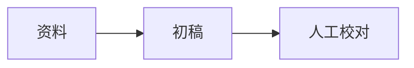

# 墨排 · 公众号写作与协作 Skill

公开地址：<https://wechat.yoru-and-akari.dev/skill.md>。站点与仓库的
`skills/wechat-typesetter/SKILL.md` 使用同一份源文件。

## 一、先写稿：网页版 AI 到这里就够用

根据用户提供的主题、读者、目的、资料和篇幅写一份完整 Markdown。事实、数字、引用和图片来源
以用户资料或核实过的来源为准；缺少依据时写明待补，不能编造人名、引语、统计或图片地址。
只负责写稿时无需登录、令牌、模型 API、Python 或 MCP，也无需读取本 Skill 的后半部分。

把稿件交给用户粘入 [墨排编辑器](https://wechat.yoru-and-akari.dev/) 左栏，右栏会实时排版。
默认只输出可粘贴的稿件源文，不加操作说明，也不把整篇稿件包进一个代码块。
视觉样式由用户在网页里选择主题；写稿时只表达内容与结构。

### 支持的 Markdown

| 写法 | 用途与注意 |
|---|---|
| 普通段落，段间空一行 | 段内单个换行会合并；要分段必须留空行 |
| `# 标题`、`## 章节`、`### 小标题` | 支持标题；二级标题是自动编号章节，其他层级按小标题处理 |
| `**加粗**`、`*斜体*`、`~~删除线~~`、行内反引号 | 常规行内强调与代码 |
| `==重点==` | 关键词重点标记，具体外观随主题；用在少量关键词上 |
| `- 要点`、`1. 步骤` | 无序 / 有序列表，宜用简单同级列表；不支持可勾选的任务列表控件 |
| `[来源说明](https://example.com/source)` | 外链转编号脚注，文末按地址去重；公众号正文不保证可点击 |
| 三反引号围栏 + 可选语言名 | 代码块保留缩进；不要用 HTML 或 CSS 控制文章样式 |
| GFM 表格 `\| 列一 \| 列二 \|` | 对齐行用 `:---` / `:---:` / `---:`；手机阅读宜少列、短文字 |
| 单独一行 `---` | 分隔线；开头成对的 `---` 另用于下面的稿件元信息 |
| `<!-- 编辑备注 -->` | 只留在源稿，不进入预览 / 复制；围栏代码块中的备注照常显示 |

### 公众号扩展

章节标题可写 `## KICKER | 标题`，例如 `## INSIGHT | 三个值得关注的变化`。
`KICKER` 是可选短标签，不要手工写章节序号；序号由排版器生成。

`> 一句话金句` 会变成金句卡。长引用使用独立的 `:::quote` 区块；居中强调使用 `:::center`。
容器起止行独占一行，前后留空行，内容可含行内标记：

```md
:::quote
这是一段有来源的引用或补充说明，可写**加粗**，也可以分段。

引用请标明说话者或资料来源。
:::

:::center
用一句话收束这一节。
:::
```

图片必须独占一个段落，用 ``；图号自动生成，图注不要再加“图 1”。
来源不齐时写 ``，网页侧栏会生成可上传的占位。不要捏造地址或 `img:` key。

- 已上传到本站的图片沿用 ``，修改文章时原样保留引用。
- 用户提供的真实公开地址可直接写 ``；外链不会自动上传，需确认允许使用且微信能访问。
- 网页写稿不要写本机磁盘路径、`file:`、`blob:` 或临时下载链接；本地图片交给用户在网页里上传。
- 原样 HTML（包括 ``、`<div>`、`<style>`）不作为正文排版语法。Python 推稿脚本虽能扫描 HTML 图片路径，写稿仍应使用 Markdown 图片。
- 匿名上传图片公网可读，默认 14 天后可能回收；图片引用不等于永久备份。

多图块只放独立图片行：

```md
:::carousel 4:3 活动现场


:::

:::gallery 3 1:1 三个观察角度


:::
```

轮播默认 `4:3`；网格默认 `2` 列、`1:1`。比例只支持 `4:3`、`3:4`、`16:9`、`9:16`、`1:1`，
网格列数只支持 `2` / `3` / `4`。同组图片要真实裁成同一比例，网页上传会处理；手写外链和
Agent 上传需自行准备，区块参数不会把不同形状的原图自动裁齐。

公式只支持独占一段的块级 `$$ … $$`（可多行），例如：

```md
$$
E = mc^2
$$
```

行内 `$…$` 不会按公式渲染。公式在网页里转成 SVG；Mermaid 图表在网页里转成 PNG 并上传，
处理完成后才能复制，匿名上传受图床额度限制。Mermaid 围栏语言后可带图注：

````md

````

`@signature` 必须独占一段，在网页中展开为署名。排版 / 校对 / 审核的姓名由网页侧栏配置，
不要在这个标记后面追加人名。

### 完整写稿模板

下面是结构模板，按主题需要增删模块。`titles` / `cover` 仅进入侧栏，不进入正文；
标题候选用简单列表，封面说明用单行文本，不写复杂 YAML、嵌套对象或额外配置字段。

```md
---
titles:
  - 文章主标题
  - 另一种表达角度
cover: 横向封面，说明主体、场景与需要预留的文字空间
---

用一到两段把问题、现场或核心信息讲清楚，给读者继续读的理由。

## CONTEXT | 发生了什么

围绕资料交代背景，保留关键事实与出处。


## INSIGHT | 为什么值得关注

### 一个具体观察

展开论证，**加粗关键判断**，用 ==重点词== 帮助扫读。

- 第一个要点
- 第二个要点

:::quote
这里放有来源的引用或必要补充；没有原始引语时改为普通说明。
:::

## ACTION | 接下来可以做什么

给出与主题有关的行动、展望或结尾，避免空泛口号。

:::center
一句自然、准确的收束。
:::

---

@signature
```

常用结构：活动报道用“现场引入 → 关键进展 → 人物 / 细节 → 后续安排”；知识文章用
“问题 → 解释 → 示例 → 操作步骤”；观点文章用“判断 → 依据 → 反例 / 限制 → 结尾”。
模块服务于内容，不要为了展示语法把金句卡、表格、轮播、公式全部塞进每一篇文章。

交稿前检查：资料未被编造；标题候选和封面说明在开头；段落间有空行；容器与代码围栏已闭合；
图片引用有依据或留空占位；已有图片 key 没改坏；没有未经支持的 HTML、复杂 YAML、行内公式或排版 CSS。
正文上限为 200 万字符，长稿宜拆篇。最终发布前由用户核对事实、图片权利和公众号预览。

本节事实源：仓库 [README](https://github.com/yoruuuchan/wechat-md-studio/blob/master/README.md)、
[示例稿](https://github.com/yoruuuchan/wechat-md-studio/blob/master/src/lib/sample.ts)、
[parser](https://github.com/yoruuuchan/wechat-md-studio/blob/master/src/lib/parse.ts) 与
[渲染说明](https://github.com/yoruuuchan/wechat-md-studio/blob/master/docs/rendering.md)。

## 二、获授权后：Remote MCP 修改当前稿件

用户在编辑器“设置 → 高级功能 → AI 直接编辑当前稿件”里创建连接，把标准 Streamable HTTP
地址和 `Authorization: Bearer …` 交给自己的 MCP 客户端。连接仅授权该游客的该篇稿件，
默认 24 小时有效，用户可随时撤销；网站会保存临时协作副本，浏览器本地稿件继续保留。
无法调用 MCP 的网页版 AI 直接按前半部分输出稿件即可。

1. 调用 `read_writing_skill` 获取此 Skill。
2. 调用 `read_current_document`，保存 `doc.content`、`doc.name` 和 `doc.hash`。
3. 在读到的稿件上修改，保留用户要求保留的内容和真实图片引用。
4. 调用 `update_current_document`，传完整 `content`、上一步的 `hash` 作为 `baseHash`，可选传 `name`。
5. `ok: true` 表示协作副本写入成功，打开的浏览器会自动同步。浏览器离线时要等恢复连接；
   不能把服务端写入成功说成已经在用户屏幕或微信后台验收。
6. 收到 `isError: true` / `error: conflict` 时，读取返回的 `current` 或重新读稿，说明两边差异并合并，
   经确认后以新 hash 写入；不得自动用新 hash 盲目覆盖。此 MCP 不提供强制覆盖、删除或访问其他稿件的工具。

撤销 / 到期后的 401 或失效错误需要用户重新授权，不能换成站长 REST 令牌绕过授权。
浏览器刷新后继续协作；若要重新复制令牌，使用“重新生成接入信息”，旧令牌立即失效。
只把连接令牌写入客户端私密配置，不写进稿件、日志、公开仓库或截图。

ChatGPT 的自定义连接若要求 OAuth，应按
[chatgpt-mcp-connect](https://github.com/yoruuuchan/chatgpt-mcp-connect) 的已验证方案在独立适配层处理。
这里提供的是核心 Bearer MCP，不能把一段静态令牌配置说成 ChatGPT OAuth 已完成。

## 三、Agent REST / Python：推稿、人工精修、读回

### 概述

`scripts/mopai.py` 是「公众号排版助手 by Yoru」（公众号 Markdown 排版 Web 应用）的 agent 客户端：把 Markdown 稿件推进线上编辑器，拿回一个 `editorUrl`，交给人在浏览器里排版、选主题、微调，最后把润色过的稿子读回来。**脚本本身不做任何渲染和排版**——排版只发生在网页里，人也在网页里完成这篇文章。所以这个技能的正确用法是"推上去 → 把链接给人 → 等改完再读回来"，而不是"在本地生成公众号 HTML"。

脚本是零依赖的 Python 3 标准库实现，Windows 和 Linux 都能直接跑，不用装任何东西。下面命令里的 `mopai.py` 指 `<技能目录>/scripts/mopai.py`（`<技能目录>` 就是本 `SKILL.md` 所在目录）；Windows 用 `python`，Linux/macOS 用 `python3`。**每条错误信息里都带 `script` 和 `envFile` 的绝对路径**，不用猜文件在哪，直接从那句报错里复制。

## 直接推送就行，不要预先检查 .env

**不要为了"保险"在推送前先跑 `token-status`、`cat .env` 或判断 `.env` 存不存在。** 直接调 `push`：令牌配好了就成功，没配好脚本会立刻失败，错误信息里已经带上 `.env` 的绝对路径、`set-token` 命令和令牌的生成方式。**只有看到那句报错时**，才去处理令牌（见下一节）。

理由很实在：预先检查是正常路径上一次纯浪费的往返——令牌 99% 的时候是好的，那次检查什么也没换来；而令牌真出问题时，`push` 自己会告诉你，且告诉得更准（它知道你在跑哪条命令、读的是哪个文件）。

## 令牌：报错后再看这一节

### 报错长什么样

没配令牌时脚本立刻失败，不会上传图片传到一半才断（stderr，退出码 1）：

```json
{"error":"缺少令牌：这个命令要带 Authorization: Bearer mopai_… 才能调用。请在 <技能目录>\\.env 里写 MOPAI_TOKEN=mopai_xxx，或执行 python <技能目录>\\scripts\\mopai.py set-token mopai_xxx。令牌在服务端 .env 的 AGENT_TOKENS=name:token 里配置，生成方法见 SKILL.md「令牌：报错后再看这一节」。","script":"<技能目录>\\scripts\\mopai.py","envFile":"<技能目录>\\.env"}
```

令牌配了但不对，是服务端回的 **401**：

```json
{"error":"令牌无效或已被吊销","hint":"带上 Authorization: Bearer mopai_… ；令牌在服务端 .env 的 AGENT_TOKENS 里配置"}
```

看到这两句之一，才需要往下走。

### 写进 .env

`<技能目录>/.env` 是配置的唯一来源（脚本刻意不读环境变量：技能的配置属于技能目录，这样不管哪个 shell、哪个 harness、哪个定时任务来调，用的都是同一个令牌）。文件已被 `.gitignore` 忽略，不会进仓库。

手动设置：把 `.env.example` 复制成 `.env`，填 `MOPAI_TOKEN=` 那一行。

Agent 代为设置（二选一，脚本会顺手把权限收到 600，Windows 上忽略）：

```bash
python <技能目录>/scripts/mopai.py set-token mopai_你的令牌

# 或从管道传入，令牌不留在 shell 历史里
echo 'mopai_你的令牌' | python <技能目录>/scripts/mopai.py set-token
```

`set-token` 是幂等的：原地替换 `MOPAI_TOKEN` 的值（`.env` 不存在就从 `.env.example` 建一个），不会堆出多行。换令牌也走它。

确认脚本到底读到了什么（只在排查时用，别当推送前的例行检查）：

```bash
python <技能目录>/scripts/mopai.py token-status
```

### 怎么造一个令牌

令牌在**服务端**签发，写进部署机上应用自己的 `.env`：

```
AGENT_TOKENS=<名字>:<令牌>            # 默认 read+write
AGENT_TOKENS=<名字>:<令牌>:read       # 只读
AGENT_TOKENS=claude-code:mopai_aaa,reviewer:mopai_bbb:read   # 逗号分隔多个
```

令牌格式是 `mopai_` + 32 字节随机数的 base64url（不带 `=` 填充）。生成一条：

```bash
python -c "import secrets,base64;print('mopai_'+base64.urlsafe_b64encode(secrets.token_bytes(32)).decode().rstrip('='))"
```

```bash
echo "mopai_$(openssl rand -base64 32 | tr '+/' '-_' | tr -d '=')"
```

`<名字>` 不是秘密，它会写进稿件的 `source`（`agent:<名字>`）和日志，用来分辨是哪个 agent 推的；只有令牌本身是秘密。一个 agent 一条，吊销时不影响别人。改完服务端 `.env` 要重启应用进程才生效。

## 使用方式

典型流程是这三步：推上去 → 把 `editorUrl` 给人 → 人改完之后读回来。

```bash
# 1. 推一篇本地 Markdown（最常用）。输出 JSON 里的 editorUrl 就是给人的链接
python <技能目录>/scripts/mopai.py push --file draft.md

# 指定标题（不给就由服务端推导：front matter 的 titles 第一项 → 第一个标题 → 未命名稿件）
python <技能目录>/scripts/mopai.py push --file draft.md --name "十月复盘"

# 推纯文本 / 管道输入（注意 --text 里的 \n 不会被转义，长文本请用 --file 或 stdin）
python <技能目录>/scripts/mopai.py push --text "# 标题"$'\n\n'"正文"
cat draft.md | python <技能目录>/scripts/mopai.py push

# 推完顺手在浏览器打开
python <技能目录>/scripts/mopai.py push --file draft.md --open
```

`push` 的输出（stdout，紧凑 JSON）：

```json
{"ok":true,"id":"abc123","name":"十月复盘","editorUrl":"https://wechat.yoru-and-akari.dev/?doc=abc123","hash":"9f2c1a7b4d5e6f80","savedAt":1730000000000,"source":"agent:claude-code","uploadedImages":2}
```

把 `editorUrl` 原样交给用户——那是进入云端稿件的编辑入口。**打开它需要浏览器侧有效的登录会话**：稿件只存在服务端，链接本身不构成匿名编辑授权；未登录时会被送到登录页，登录后回到这篇稿件（这条行为以 [Agent API](../../docs/agent-api.md) 的说明为准）。`hash` 存下来，回推时用得上（见「关于稿件的改动与冲突」）。图片没全传上去时多一个 `warnings` 数组，同时逐条打到 stderr，但推送本身算成功。

```bash
# 2. 读回人工润色过的稿子
python <技能目录>/scripts/mopai.py get abc123                 # Markdown 原文打到 stdout
python <技能目录>/scripts/mopai.py get abc123 --out draft.md  # 写文件，stdout 改成元信息 JSON（含 hash）
python <技能目录>/scripts/mopai.py get abc123 --meta          # 只要元信息，不要正文

# 3. 回推改过的版本（带锁，人在浏览器里改过就 409）
python <技能目录>/scripts/mopai.py update abc123 --file draft.md
python <技能目录>/scripts/mopai.py update abc123 --file draft.md --base-hash 9f2c1a7b4d5e6f80
python <技能目录>/scripts/mopai.py update abc123 --file draft.md --name "十月复盘（终稿）"
python <技能目录>/scripts/mopai.py update abc123 --file draft.md --force   # 无条件覆盖，慎用
```

```bash
# 列稿件（只有摘要，不含正文；--saved 只看已进草稿箱的）
python <技能目录>/scripts/mopai.py list
python <技能目录>/scripts/mopai.py list --saved --limit 20 --offset 0
python <技能目录>/scripts/mopai.py search 排版          # 等价于 list --q 排版
python <技能目录>/scripts/mopai.py list --q 排版 --saved

# 主题表（实时从服务端拉，脚本里不存副本）
python <技能目录>/scripts/mopai.py themes

# 我是谁、有什么权限、服务端时间
python <技能目录>/scripts/mopai.py whoami

# 令牌相关
python <技能目录>/scripts/mopai.py set-token mopai_xxx
python <技能目录>/scripts/mopai.py token-status
```

通用参数（放在子命令前后都行）：`--base-url` 临时换地址（不改 `.env`）、`--timeout` 换超时秒数、`--pretty` 让 stdout 输出缩进 JSON 并在 stderr 附一份给人看的摘要。

**默认输出是 stdout 上的紧凑 JSON**，因为调用方通常是要解析结果的 agent；人手动跑时加 `--pretty`。`get` 例外：它默认把 Markdown 原文打到 stdout（那就是它的"数据"），要元信息就加 `--meta` 或 `--out`。

退出码：`0` 成功，`1` 错误（服务端报错、连不上、缺令牌、409 冲突），`2` 用法错误（参数不对、文件不存在、`delete`）。

**没有 `delete`。** agent 不能删稿件：删除是人在网页里做的动作。脚本收到 `delete` 会直接说明这件事并以退出码 2 结束，不会去碰服务端。

## 图片处理

推送（`push` / `update`）时脚本会扫正文里的图片引用，把本地图片逐个传到 `POST /api/agent/images`，再把引用改写成服务端返回的 `ref`：

- 扫两种语法：Markdown ``（含 `` 和 `"title"`）与 HTML ``。
- **改写结果是 `img:<key>`。** 网页会把短引用展开成本站的稳定图片地址；上传响应里的 `url` 可供查看。真实的公开 HTTPS 图片地址也能使用，其可用性与保存期限取决于原图床。
- 跳过一切带 scheme 的引用（不是本地路径，没什么可传）：`http://`、`https://`、`//`、`data:`、`blob:`、`mailto:`，以及本应用自己的两个协议 `img:`（图床短引用，网页会展开成稳定图片地址）和 `docx-import:`（导入 DOCX 时留下的待上传占位）。**这两个后面都没有斜杠**，所以按 `img://` 那样判断会漏掉它们、把一串不是路径的字符串当文件去上传。
- 相对路径按 **Markdown 文件所在目录**解析，不是当前工作目录。`--text` / stdin 没有"所在目录"，按 cwd 解析。
- 白名单：`.png .jpg .jpeg .gif .webp .svg`。单张上限 **20MB**（超了本地就拦下，不浪费一次上传）。
- 同一张图在一篇里引用多次只上传一次（按解析后的绝对路径缓存）。
- **单张失败不中断推送**：原引用保留，原因进输出的 `warnings` 数组，稿件照常创建。图片不存在、格式不支持、太大、图床报错都是这一类。

## 关于稿件的改动与冲突

推上去之后到读回来之前，**人会在浏览器里改这篇稿子**——这是设计好的流程，不是意外。所以覆盖写入必须带锁。

- `GET` 一篇稿件会返回 `hash`：正文 sha256 的前 16 位。它不是时间戳，所以不受客户端时钟和秒级精度影响，内容一样 hash 就一样（重推同样的文本不会假冲突）。
- `PUT` 时把它作为 `baseHash` 带上，服务端发现当前 hash 对不上就拒绝写入，回 **409** 和 `current`（现在的 `name` / `content` / `updatedAt` / `source` / `hash`）。
- **服务端不接受"什么都不带"的写法**：没有 `baseHash` 又没有 `force: true` 的更新会被 **400** 拒绝（提示写明要 baseHash 还是要 force）。这是刻意的——盲覆盖会把人在浏览器里的修改直接冲掉，覆盖必须是一次显式声明。
- **409 的意思是"重新读一遍再决定"**，不是失败重试。stdout 上会给出完整的 `current`，`hint` 里直接写好下一步：把人的版本作为基础改，然后 `--base-hash <current.hash>` 重试。默认退出码 1。
- `--force` 会发送 `force: true`（不带 `baseHash`），无条件覆盖最新版，**会把人在浏览器里的修改直接冲掉**。所以它必须是一次明确的决定，不要当默认。
- 不带 `--base-hash` 也不带 `--force` 时，脚本会先 `GET` 一次拿当前 hash 再写：这把锁只保护"读和写之间"那一小段，防不住更早之前的人工修改。要真正不覆盖人的劳动，**把上次 `push` / `get` 拿到的 hash 用 `--base-hash` 传进来**。`get --out` 就是为这个流程准备的：正文进文件，hash 进 stdout。

推荐的往返：

```bash
python <技能目录>/scripts/mopai.py get abc123 --out draft.md   # stdout 里有 hash
# …在 draft.md 上改…
python <技能目录>/scripts/mopai.py update abc123 --file draft.md --base-hash <上一步的 hash>
```

## 令牌安全

- `.env` 被 `<技能目录>/.gitignore` 忽略，只有 `.env.example` 进仓库。**不要**为了省事把令牌写进 `SKILL.md`、脚本、命令历史或文章正文。
- 所有输出里的令牌都是掩码：`mopai_abcd…wxyz（共 42 字符）`，完整令牌不会被打进日志。
- `set-token` 会尝试把 `.env` 权限收到 600（Windows 上没有意义，失败会被吞掉，不影响命令）。
- 同步这个技能到别的位置（比如全局技能目录）时**必须排除 `.env`**：仓库里那份是模板，落地位置那份是真配置，覆盖掉的表现是"昨天还能推，今天突然说缺令牌"。
- 吊销：在服务端 `.env` 的 `AGENT_TOKENS` 里删掉那一行并重启应用即可，其他 agent 不受影响。已经推进去的稿件不会因此消失，`source` 里还留着它的名字。

## 故障排查

一行一条：现象 → 原因 → 动作。

- **`缺少令牌`（退出码 1）** → `.env` 里没有 `MOPAI_TOKEN` → `python <技能目录>/scripts/mopai.py set-token mopai_xxx`。
- **HTTP 401 `这个端点需要令牌`** → 请求根本没带 Authorization → 同上，`set-token` 写进去。
- **HTTP 401 `令牌无效或已被吊销`** → 令牌抄错了、少字符，或服务端 `AGENT_TOKENS` 里那行被删了 → 核对令牌；必要时重新生成并让站长加回服务端 `.env`，重启应用。
- **HTTP 403 `令牌 X 只有 read 权限`** → 令牌有效但权限不够（401 是"不认识你"，403 是"认识你但这件事不许做"）→ 在服务端把那行改成 `name:token`（默认 read+write），或换一个可写令牌。
- **HTTP 404（`get` / `update`）** → 稿件 id 不对，**或者它已经被删进回收站**。agent 看不到也不能复活回收站里的稿件 → `list` 找 id；确实被删了就重新 `push` 一篇，别指望 `update`。
- **HTTP 409 `conflict`** → 你上次读到之后有人在浏览器里改了 → 读 stdout 的 `current.content`，在它基础上改，再 `--base-hash <current.hash>` 重试；确认要覆盖才 `--force`。
- **HTTP 400 `缺少 baseHash：不能盲覆盖`** → 直接 `PUT` 时既没有 `baseHash` 也没有 `force: true`。用脚本不会遇到（脚本会自动补一个：先 GET 再写，或 `--force`）；手写 curl 时按提示二选一。
- **HTTP 413** → 正文超 200 万字符，或单张图超 20MB → 拆篇；图片先压缩。
- **HTTP 400 `参数不对`** → `content` 空了或缺了 → 检查文件路径和文件内容。
- **HTTP 500 `图床未配置` / `图片上传失败`** → 服务端到图床（R2 worker）不通或 `IMG_BASE_URL` / `IMG_ADMIN_KEY` 没配 → 这是服务端问题，把报错原样转给站长；稿件本身已经推进去了，图留在 `warnings` 里。
- **`返回的不是 JSON（…）`** → 命中的是 Cloudflare Access 拦截页或反代错误页，不是应用 → 见下一条。
- **`连不上 <url>` / 超时 / 403 HTML 页** → 部署在 Cloudflare Access 后面，`/api/agent/*` 没被放行。Access 是按路径策略工作的，需要在 Access 应用里给 `/api/agent/*` 加一条 **Bypass** 策略（认证交给脚本的 Bearer 令牌）。**这是运维在 Cloudflare 控制台做的动作，脚本改不了**；改完用 `curl -s -o /dev/null -w '%{http_code}' <base>/api/agent/whoami` 应返回 401 而不是 302/403。
- **改了 `.env` 却不生效** → 文件位置不对，`.env` 必须和 `SKILL.md` 同级，丢进 `scripts/` 不会被读 → `token-status` 看 `envFile` 指的是哪个路径。
- **`editorUrl` 打开是另一个域名 / 相对地址不对** → 服务端 `PUBLIC_BASE_URL` 没配，`editorUrl` 会退回用请求的 origin 拼 → 在服务端 `.env` 里配 `PUBLIC_BASE_URL` 并重启。
- **`editorUrl` 打开先跳登录页** → 正常行为：云端稿件需要浏览器侧的有效登录会话，链接本身不是匿名编辑授权 → 用站长口令登录后会自动回到这篇稿件。
- **中文输出乱码或 `UnicodeEncodeError`** → cp936 控制台的老问题；脚本启动时已把 stdout/stderr 重配成 UTF-8，并对写不出的字符降级替换 → 如果仍然乱码，是终端字体/代码页的问题，`chcp 65001` 或换 Windows Terminal。
- **推送卡住不动** → 大图在慢链路上，或 `--text`/stdin 在等输入（不是 tty 就会读 stdin）→ 加 `--timeout`，或改用 `--file`。
